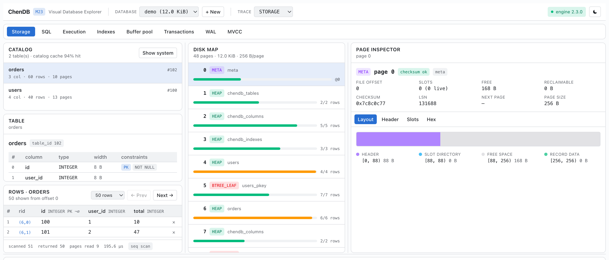
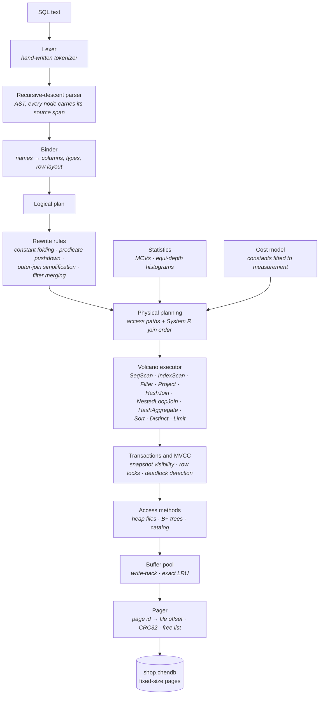
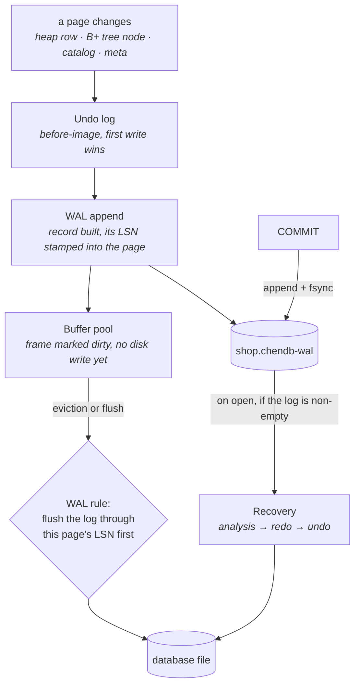

# ChenDB

[](https://github.com/YheChen/ChenDB/actions/workflows/ci.yml)
[](LICENSE)


**A relational database engine built from scratch in Python: slotted pages,
disk-backed B+ trees, a cost-based optimizer, ARIES write-ahead recovery and
MVCC, with a browser-based explorer that shows the engine working on a real
file.**

**B+ Tree Storage · Cost-Based Optimizer · WAL/ARIES Recovery · MVCC ·
Volcano Executor · No runtime dependencies**

**1,955 engine tests · 160 frontend tests · 1,024 generated queries checked
against SQLite on every push, 160,000 in a full campaign · 24 documented
milestones**

[Live demo](https://chendb.vercel.app) · [Architecture](#architecture) ·
[Storage](#storage-engine) · [Query processing](#query-processing) ·
[Transactions](#transactions-and-concurrency) · [Recovery](#recovery) ·
[Correctness](#correctness) · [Benchmarks](#benchmarks) ·
[Docs](#documentation) · [Limitations](#deliberately-not-built)

### [Try it in your browser →](https://chendb.vercel.app)

No install, no server, no account. The engine is compiled to WebAssembly and
runs in your tab against a database created the moment you arrive. Give it
twenty seconds to boot: it is loading a Python runtime.

[](https://chendb.vercel.app)

Every number in that screenshot was read back from a real file: 48 pages of 256
bytes each, a meta page whose checksum was verified on read, a B+ tree leaf
holding a primary-key index nobody asked for, and a sequential scan that touched
9 pages in 195 µs, the plan the cost model preferred.

---

## Written from scratch

Nothing below is a wrapper around an existing database, and nothing is a stub.

| | |
|---|---|
| **Engine dependencies** | none. `engine/` imports the Python standard library and nothing else: no ORM, no parser generator, no storage library. A [CI job](.github/workflows/ci.yml) runs it on an interpreter with nothing installed, and [`tests/unit/test_architecture_boundaries.py`](tests/unit/test_architecture_boundaries.py) fails the build if an import crosses the line |
| **Size** | ~31,000 lines of engine Python, ~19,000 lines of tests, ~13,000 lines of TypeScript for the explorer, ~9,000 lines of design documentation |
| **On-disk format** | ChenDB's own, at [format version 5](docs/storage-format.md): a 16-byte magic, fixed-size pages, a CRC32 per page, a free list threaded through freed pages, system catalog tables stored as ordinary heap tuples |
| **Not stubbed** | a feature absent from the engine is absent from the HTTP API and hidden in the UI, enforced by [a test](tests/integration/test_demo_sql.py) rather than by discipline |

FastAPI, Pydantic and uvicorn appear only in `engine/server/`, the optional HTTP
layer the web explorer talks to. The database itself never sees them.

---

## Architecture

Dependencies point one way, and four boundary rules are asserted by
[`tests/unit/test_architecture_boundaries.py`](tests/unit/test_architecture_boundaries.py):
nothing under `engine/` outside `engine/server/` may import a web framework or
anything outside the standard library, `engine/server/` imports `engine` and
never the reverse, and diagnostic events cannot serialize themselves.

```
visualizer (TS) ──HTTP/WS──▶ engine.server ──imports──▶ engine.* (stdlib only)
```

### A query, top to bottom



`EXPLAIN` prints the plan the physical planner chose *and* the candidates it
rejected, with both costs. Statistics and the cost model are inputs to planning,
not stages in the pipeline, which is why they enter from the side.

### A write, and what makes it durable

Every page change in the engine funnels through one method,
`Pager._write_at`, which is what lets undo and logging exist without any
subsystem knowing they do.



A commit fsyncs one log record and forces no pages: **steal + no-force**, in
ARIES vocabulary. Rollback restores before-images through the ordinary page
path, so the same code recovery uses is exercised on every `ROLLBACK`.

[docs/architecture.md](docs/architecture.md) has the module-by-module picture
and an insert traced end to end.

---

## Storage engine

**Pages.** One file of fixed-size pages, 4 KiB by default (256 B to 64 KiB;
the explorer offers 256 so a handful of rows fills a page and page splits are
visible). Page 0 is the meta page and holds the root of every persistent
structure. Every other page carries a 24-byte header with a CRC32 that is
verified on read, a type discriminator, an LSN and a next-page pointer.

**Slotted layout.** A header and a slot directory grow from the front, record
data grows from the back, and they meet in the middle. Callers hold a slot
index, never a byte offset, so compaction can move a record inside its page
without invalidating any reference; deletes write a tombstone into the slot in
O(1). This is PostgreSQL's `PageHeaderData` + `ItemIdData` arrangement; the
comparison, and where ChenDB spends two bytes more per row than SQLite, is
written out in [`engine/storage/page.py`](engine/storage/page.py).

**Records.** `INTEGER` / `FLOAT` / `BOOLEAN` / `TEXT`, encoded against the
schema with a null bitmap, so a NULL column occupies no payload bytes at all.

**Heap files.** One linked chain of pages per table, O(1) append, lazy scan,
tombstone deletes. The page allocator prefers a free list threaded through the
freed pages themselves, so dropping and recreating data reuses file space
instead of growing the file.

**B+ trees.** Disk-backed, one page per node, with order-preserving key
encoding so `memcmp` order is value order. Internal nodes hold separators only,
leaves hold `(key, record id)` and are linked, so a range scan descends once and
walks sideways. Inserts split bottom-up along the descent path: a full leaf
splits and copies a separator up; a full internal node splits and *moves* its
middle separator up; when the root splits a new root is allocated above it and
every leaf stays at the same depth. Deletes are the honest part: an entry is
removed and **the leaf is left underfull, with no merging or redistribution**,
a deliberate trade documented in
[`engine/index/bplustree.py`](engine/index/bplustree.py) and
[docs/milestone-05-btree-index.md](docs/milestone-05-btree-index.md).

**Buffer pool.** Fixed frame count, write-back, and *exact* LRU: residency is
an `OrderedDict`, so the victim is `popitem(last=False)` and a touch is
`move_to_end`, both O(1). A dirty victim is written back on the way out, and the
WAL is flushed through that page's LSN first. There are no pin counts, because
the pool copies bytes out of a frame on read and into it on write rather than
handing out a pointer. [The module docstring](engine/storage/buffer.py) argues
that case, prices the memcpy against the syscall it replaces, and says exactly
when the design stops being adequate.

---

## Query processing

**Front end.** A hand-written tokenizer and a recursive-descent parser, no
parser generator. Precedence is encoded in the shape of the grammar rules, and
every AST node records the source span it came from, which is what lets the
explorer highlight the exact SQL behind a node you click. `IS NULL` is its own
node type, never an equality against NULL; they mean different things under
three-valued logic.

**Supported SQL**, all of it exercised by the tests:

| | |
|---|---|
| DDL | `CREATE TABLE` with `PRIMARY KEY` / `NOT NULL`, `CREATE INDEX ... UNIQUE`, `ANALYZE` |
| DML | `INSERT`, `UPDATE ... SET ... WHERE`, `DELETE ... WHERE`, Halloween-safe |
| Queries | `SELECT DISTINCT`, `WHERE`, `IN` / `NOT IN`, uncorrelated scalar subqueries, inner joins and `LEFT` / `RIGHT` / `FULL OUTER JOIN` with aliases and self-joins, `GROUP BY` / `HAVING`, `COUNT` / `SUM` / `AVG` / `MIN` / `MAX`, `ORDER BY` (NULLs last ascending, first descending, PostgreSQL's default), `LIMIT` / `OFFSET` |
| Transactions | `BEGIN`, `COMMIT`, `ROLLBACK` |
| Introspection | `EXPLAIN` and `EXPLAIN ANALYZE` on `SELECT`, `UPDATE` and `DELETE`, with estimated rows beside actual and every rejected alternative |

**Planning.** A logical plan is first rewritten by rules (constant folding,
trivial filter removal, adjacent filter merging, identity-projection removal and
outer-join simplification), then physical planning enumerates the ways to run it
and costs each one. Access-path selection is a loop over the sequential scan plus
one index scan per usable index. Join order is System R's dynamic programme over
left-deep trees, restricted by what the outer joins in the query allow: an outer
join is neither commutative nor associative, so the search treats it as a barrier
rather than reordering across it blindly. Predicate pushdown happens here rather
than in the rules, because whether a conjunct can sit below a join depends on
which join order the search picked.

Before the search runs, the planner checks whether an outer join is *really*
outer. `a LEFT JOIN b ON … WHERE b.x = 5` is not: `b.x` is NULL in every row the join
preserved, `NULL = 5` is NULL, and `WHERE` keeps only TRUE, so those rows die
anyway. Proving it restores commutativity, associativity and pushdown at once.
`EXPLAIN` names the rewrite, as it names every rewrite.

**Statistics and cost.** Per column: distinct count, min, max, null count, a
most-common-values list with exact counts, and an equi-depth histogram over the
rest, so a column holding 90% `info`, 9% `warn` and 1% `error` produces three
different estimates rather than one average of them. The cost constants were
**fitted to measurements of this engine**, not copied from PostgreSQL, whose
defaults make CPU a hundredth of a page read; here an interpreted
`decode_record` makes it about a seventh.
[`tests/unit/test_estimates.py`](tests/unit/test_estimates.py) runs each case
twice, once for what the planner predicted and once for what came back, which
is the test that was missing when a join estimate sat 80× under its true value.

**Execution.** Volcano-model operators (`SeqScan`, `IndexScan`, `Filter`,
`Project`, `NestedLoopJoin`, `HashJoin`, `HashAggregate`, `Sort`, `Distinct`,
`Limit`), three-valued logic throughout, and a step-through debugger with real
cancellation. A hash join builds on the side the estimator says is smaller,
because a build costs more than a probe.

---

## Transactions and concurrency

**Transactions.** `BEGIN` / `COMMIT` / `ROLLBACK`, plus implicit transactions
for bare statements. Undo is *physical*: a page-level before-image log, first
write wins. Because every write in the engine passes through one pager method,
that hook made DDL atomic and index operations undoable without
`engine/catalog/` or `engine/index/` learning that transactions exist.

**MVCC.** Rows carry `xmin` / `xmax` headers and form version chains. An
`UPDATE` writes eight bytes to the old version and appends a new one; a `DELETE`
writes eight bytes and removes nothing. A snapshot sees a version when its
creator committed before the snapshot and its deleter did not, plus the
transaction's own writes. So **a reader never waits for a writer**: it reads an
older version instead of blocking, and takes no lock of its own.
[`tests/unit/test_mvcc.py`](tests/unit/test_mvcc.py) asserts that while one
session holds a row lock.

Isolation levels: `READ COMMITTED` (a fresh snapshot per statement) and
`REPEATABLE READ` (one snapshot for the transaction's life). Serializable is
[not implemented](#deliberately-not-built).

There is no commit log, no `pg_xact` equivalent, and that is a consequence of
physical undo: an aborted transaction's rows are physically gone, so every row
that survives to be read was written by a committer, and the whole structure
collapses to one number (`frozen_xid`, set at each checkpoint). The bill for
that arrives elsewhere: rollback costs time proportional to pages touched.
[`engine/concurrency/snapshot.py`](engine/concurrency/snapshot.py) makes the
argument.

**Locking.** Writers take locks on *record ids* (a page and a slot) rather than
on pages or tables, because page-level locking would make two inserts into the
same heap page conflict. Deadlocks are **detected, not prevented**: the lock
manager builds a wait-for graph, looks for a cycle immediately, and aborts the
youngest transaction in it. There is no lock escalation; `MAX_LOCKS_PER_TRANSACTION` is
the honest failure instead. Dead versions are reclaimed by a manual
`Database.vacuum()`.

---

## Recovery

A write-ahead log in a sidecar file (`shop.chendb-wal`), an LSN stamped into
every page, sharp checkpoints that flush everything and truncate the log, and
ARIES recovery on open.

Two rules make it a write-ahead log rather than a diary: a page may not reach
the database file before the record describing it is durable (the buffer pool's
eviction path flushes the log through the page's LSN), and a commit is not a
commit until its record is fsynced. Together they buy **steal + no-force**: the
pool may evict uncommitted pages, and a commit forces no pages at all.

Recovery is three passes, and the middle one surprises people:

| Pass | What it does |
|---|---|
| **Analysis** | scan forward from the checkpoint; classify each transaction as a winner (committed) or loser |
| **Redo** | replay every logged change, **losers included** (ARIES calls it repeating history), skipping any record whose page already has a higher LSN, which is what makes recovery idempotent |
| **Undo** | walk each loser's records backwards, restoring before-images, *logging each restore first* (compensation records) so a crash mid-undo does not restart from the beginning |

What is deliberately absent: no dirty-page table and no transaction table are
reconstructed during analysis, because sharp checkpoints mean redo can always
start at the first record after the checkpoint.
[`engine/wal/recovery.py`](engine/wal/recovery.py) and
[docs/milestone-09-wal.md](docs/milestone-09-wal.md) cover the rest, including
how a 197× write amplification became 5×.

**The evidence.** [`tests/recovery/`](tests/recovery/) kills a real child
process with `SIGKILL`: no `close()`, no `fsync`, no atexit hooks, because any
cooperative shutdown would flush the very buffers whose loss is under test. It
asserts that a committed transaction survived and that an uncommitted one was
rolled back on the next open. The explorer has a crash button that does the same
thing live.

---

## Correctness

```bash
.venv/bin/python -m pytest        # 1,955 passed, 56 skipped
npm --prefix visualizer test      # 160 passed
```

Both suites, plus lint, format, a TypeScript typecheck, the generated API types,
the browser build and every narrated example run on every push and pull request
([`.github/workflows/ci.yml`](.github/workflows/ci.yml), three jobs).

### Differential testing against SQLite

[`tests/differential/`](tests/differential/) generates random schemas, rows and
typed queries from a seed, runs each against both ChenDB and SQLite, and
compares the answers. A hand-written test can only check what its author thought
of; a second engine does not have to think of anything.

| | |
|---|---|
| Per CI run | 64 seeds × 16 queries = **1,024 query pairs**, one pytest case per seed so a failure names its own repro |
| A campaign | `scripts/differential.py --seeds 0:10000` → **160,000 query pairs**, zero unexplained divergences (722 accounted for by registry rules, 789 needing the float tolerance), ~3 min on an M-series laptop |
| Query shapes generated | scans, joins, self-joins, join chains, aggregates, grouped aggregates, DML |
| Found | seven bugs on its first campaign, two of which returned a wrong answer with no sign of trouble; two more when the generator learned to build a third table. All nine are written up in [docs/milestone-17-differential.md](docs/milestone-17-differential.md) and [docs/milestone-21-three-tables.md](docs/milestone-21-three-tables.md) |

Three things make it more than a fuzzer:

- **A shrinker.** The minimal failing case is computed *before* the failure is
  rendered, so the CI log already contains the smallest schema, both dialects of
  the query, the differing cell and the commands to reproduce it.
- **A divergence registry.** Legitimate differences (ChenDB raises on division
  by zero where SQLite returns NULL) are recorded as rules with counters, and
  [`tests/differential/test_registry.py`](tests/differential/test_registry.py)
  *fails when a registered difference stops diverging*, so the excuse list
  cannot outlive the reason for it.
- **Floors on the counters.** Every run reports how many pairs it compared, how
  many SELECTs returned rows, how often each rule fired; `test_harness.py`
  asserts minimums on all of it. A differential tester that has quietly stopped
  comparing anything is fast, green and worthless, and looks exactly like one
  that works.

### Other suites worth naming

- **Crash and corruption:** `SIGKILL` on a child process; truncated log tails;
  flipped bytes caught by the page CRC32.
- **Observation is free of side effects:** the same workload at trace levels
  `OFF`, `STORAGE` and `VERBOSE` must produce byte-identical database files.
- **Architecture boundaries:** the four import rules above, as assertions.
- **Estimates against reality:** every cost estimate compared with the row
  count that actually came back.
- **Demo SQL:** every statement the explorer's buttons can produce is executed
  against the real engine, so the UI cannot offer something the engine refuses.

---

## Benchmarks

Seven benchmarks ship in the repo and print their own tables. Absolute times
depend on the machine; the ratios and the µs-per-cost-unit column are the
interesting parts.

```bash
make bench-all                         # all seven, in order
```

| | |
|---|---|
| `benchmarks/index_vs_scan.py` | where an index wins, and where it loses |
| `benchmarks/buffer_pool.py` | hit rate against pool size, sequential flooding, write-back |
| `benchmarks/btree_inserts.py` | build cost, index maintenance, height and occupancy |
| `benchmarks/joins.py` | hash join against the nested loop it replaced, and build-side choice |
| `benchmarks/transactions.py` | commit throughput, the price of one `fsync`, rollback cost |
| `benchmarks/recovery.py` | the three ARIES passes timed, and what a checkpoint reclaims |
| `benchmarks/trace_overhead.py` | what diagnostics cost |

`benchmarks/index_vs_scan.py`, 20,000 rows, 4 KiB pages, medians of 5 runs,
Python 3.14 on Apple silicon:

```
 predicate            rows    seq scan  index scan   planner chose
 bucket < 1             20      79.1 ms      0.5 ms   index scan   correct
 bucket < 10           200      82.6 ms      2.0 ms   index scan   correct
 bucket < 50          1000      86.1 ms      9.0 ms   index scan   correct
 bucket < 200         4000     113.8 ms     35.5 ms   index scan   correct
 bucket < 700        14000     119.5 ms    123.3 ms   seq scan     correct
```

The crossover is real, and it is the whole argument for costing plans rather
than picking by rule: an index scan pays one heap read per matching row, so at
70% selectivity it loses to a scan that reads every page exactly once. The same
run reports how well the model tracks what happened:

```
 predicate                   estimated    measured   µs/unit
 bucket < 1   (index)               30       0.4 ms      12.5
 bucket < 50  (index)              979       7.9 ms       8.1
 bucket < 200 (index)             3402      31.2 ms       9.2
 bucket < 700 (index)            11454     121.9 ms      10.6
 bucket < 700 (seq)              11741     116.0 ms       9.9
```

Near-constant cost-per-unit across two orders of magnitude, **and the same for
both access paths**. A model that is self-consistent but mis-weights one path
against the other picks the wrong plan while looking calibrated.
`CREATE INDEX` over the same 20,000 rows takes 1,442 ms and builds a height-3
tree of 188 pages with 185 splits, row by row at O(n log n).

Four results from the other five scripts, all reproducible with the commands
above:

| | |
|---|---|
| **Sequential flooding is real** | a scan of an 86-page table through a 4, 8, 16 or 32-frame pool hits **0%**. Every page it loads is evicted before the next pass wants it, so the cache does no good and discards what it held. The same pools on a 6-page working set hit 84.5% (4 frames) to 97.5% (8 and up) |
| **Write-back absorbs almost everything** | a 600-row insert issues 2,048 logical page writes and 75 syscalls, 96% absorbed, because 1,845 of them replaced a page that was already dirty in a frame |
| **A hash join pulls away fast** | 13.8× faster than a nested loop at 100 x 400 rows, 53.7× at 400 x 1,600. The loop is forced by swapping the plan node, since `PlannerOptions` has no switch for it |
| **Commit is fsync-bound, and only then** | 1,000 single-row transactions spend 50.9 ms of their 139.6 ms on 1,004 `fsync` calls, about 50 µs each. At 100 rows per transaction that difference is 0.9 ms, inside this machine's noise |

Recovery is timed too: a crash losing 5,000 committed rows replays them in
38.5 ms, split 15% analysis, 77% redo, 8% undo, with no page having been forced
at commit time. [docs/performance.md](docs/performance.md) has every table,
milestone by milestone, including the read path broken down to nanoseconds and
the 35× cost of an unguarded event emit that is why every emit in the engine
sits behind a boolean.

---

## Quick start

```bash
git clone https://github.com/YheChen/ChenDB.git && cd ChenDB
```

### The engine alone, no dependencies

```bash
python -m engine demo.chendb
```

```
chendb> .create users id:INTEGER* email:TEXT! age:INTEGER
created table users with 3 column(s)
chendb> INSERT INTO users VALUES (1,'ada@example.com',36),(2,'alan@example.com',NULL);
inserted 2 row(s) into users
chendb> CREATE INDEX users_age ON users (age);
created index users_age on users(age); 2 entries, height 1
chendb> SELECT email FROM users WHERE age = 36
email
------------
ada@example.com
(1 row(s), 4 page(s) read, 0.27 ms)
Project  email
  └─ Filter  (age = 36)
    └─ SeqScan  table=users
chendb> .indexes
index                  on                     type      h   entries  pages  unique
users_age              users.age              INTEGER   1         2      1  -
users_pkey             users.id               INTEGER   1         2      1  yes
```

Two things there are the engine being accurate rather than flattering. The query
**does not use the index it just built**: two rows fit in one page, so a scan is
cheaper than a tree descent plus a heap fetch, and `EXPLAIN` names the index it
turned down and by how much. And `users_pkey` was never asked for: a
`PRIMARY KEY` builds a real unique index, which is what makes it a constraint
rather than a note in the catalog, so it is listed like any other index because
it costs real pages.

`.help` lists the rest: `.tables`, `.schema`, `.indexes`, `.tree`, `.find`,
`.page`, `.hex`, `.events`.

### Embedded

```python
from engine import Column, DataType, Database, Schema

with Database.open("shop.chendb") as db:
    db.create_table("users", Schema.of(
        Column("id", DataType.INTEGER, nullable=False, primary_key=True),
        Column("email", DataType.TEXT, nullable=False),
    ))
    db.insert("users", (1, "ada@example.com"))
    db.create_index("users_email", "users", "email", unique=True)
    print(db.lookup("users_email", "ada@example.com"))

    for record_id, row in db.scan("users"):
        print(record_id, row)
```

### With the visualizer

```bash
python -m venv .venv && .venv/bin/pip install -e '.[server,dev]'
npm --prefix visualizer install
.venv/bin/python -m engine.server --workspace workspace   # API on :8000
npm --prefix visualizer run dev                           # UI on :5173
```

Create a database with **256-byte pages** and a handful of rows will fill a
page, so the heap chain grows while you watch. The browser-only build, with the
engine inside the page and no server anywhere, is
`npm --prefix visualizer run preview:wasm`; that is what
[chendb.vercel.app](https://chendb.vercel.app) serves, with each visitor's
database kept in IndexedDB so it survives a refresh.

---

## The explorer

Eight workspaces over one engine (storage, SQL, execution, indexes, buffer pool,
transactions, WAL and MVCC), each fed by the panel data the engine already
exposes. A sketch of the index workspace, whose numbers come from a real tree:

```
┌──────────────────────────────────────────────────────────────────────────┐
│  ChenDB  M24    database: demo (105 KiB)     trace: STORAGE    ● engine  │
├──────────────────────────────────────────────────────────────────────────┤
│ [Storage][SQL][Execution][Indexes][Buffer][Txns][WAL][MVCC]              │
├──────────────────┬───────────────────────────────────────────────────────┤
│  INDEXES         │  POINT LOOKUP   [ 42            ]  Search             │
│  users_age       │  found yes   matches 13   pages read 4   height 3     │
│   users.age      │  path: p82 → p81 → p67                                │
│   h3 · 600 · 33p ├───────────────────────────────────────────────────────┤
│  users_email     │  B+ TREE   height 3 · 33 nodes                        │
│   users.email    │                    ┌────┬────┐  p82                   │
│  users_pkey      │                    │ -∞ │ 37 │                        │
│   users.id uniq  │                 ┌──┴────┴──┬─┘                        │
│                  │        ┌────┬───▼┬────┐ ┌──▼─┬────┬────┐              │
│                  │        │ -∞ │ 19 │ 35 │ │ -∞ │ 38 │ 61 │              │
│                  │        └────┴────┴────┘ └────┴────┴────┘              │
│                  │   ┌──────┐╌╌▶┌──────┐╌╌▶┌──────┐╌╌▶┌──────┐           │
│                  │   │18 18…│   │19 19…│   │21 21…│   │40 40…│  ← leaves │
│                  │   └──────┘   └──────┘   └──────┘   └──────┘           │
├──────────────────┴───────────────────────────────────────────────────────┤
│  EVENT TIMELINE                                            live  ▮▮  ⨯    │
│  #15500 index    IndexSearch  index_name=users_age key=42 found=true      │
│                               matches=13 pages_visited=4 depth=3  392 µs  │
│  #15499 storage  PageRead     page_id=67 file_offset=34304 disk 333 ns    │
└──────────────────────────────────────────────────────────────────────────┘
```

It is fed by the same diagnostics the tests use: **47 event types** across 14
categories at 5 trace levels, with bounded retention, dropped events counted
rather than silently discarded, and a test asserting that tracing cannot change
the bytes on disk.

Three things it makes visible that a log line would not:

**A row moving through the plan.** Step a query and `next()` calls travel down
the operator tree while rows travel up:

```
operator_next  project_1   Project.next()        ← next() travels DOWN
operator_next  filter_1    Filter.next()
operator_next  scan_1      SeqScan.next()
page_read                  page 3 at offset 768  ← storage does its work
row_emitted    scan_1      (1, 'ada@x.com', 36)  ← rows travel UP
row_emitted    filter_1    (1, 'ada@x.com', 36)
row_emitted    project_1   ('ada@x.com')
...
row_emitted    scan_1      (2, 'alan@x.com', NULL)
operator_next  scan_1      SeqScan.next()        ← no filter emit: dropped
```

Those last two lines are the point: `NULL >= 18` is *unknown*, unknown is not
TRUE, so the filter drops the row. Required SQL behaviour, made visible.

**Where an AST node came from.** Click a node and the editor highlights the
exact SQL, so `AND` sitting above `>=` is visibly a consequence of the grammar's
shape rather than a precedence table.

**Real bytes.** Select a slot and the hex view highlights the range it points
at, next to the decoded row:

```
00000300  b9 c1 5b ce 00 00 00 00  00 00 00 00 02 00 05 00   ← header
00000310  2c 00 52 00 04 00 00 00  e3 00 1d 00 bd 00 26 00   ← slot directory
...
000003f0  61 64 61 40 65 78 61 6d  70 6c 65 2e 63 6f 6d 01   ← record data

slot 0  offset 227  len 29
  id=1   email=ada@example.com   age=NULL   active=true
  null bitmap 0x04 = 0010  ·  29 bytes total
```

`0x04` is bit 2, `age` is NULL, and it occupies no bytes at all. The full layout
is in [docs/storage-format.md](docs/storage-format.md).

---

## Deliberately not built

Each of these is named and argued where it would have lived, in a milestone
document or in the module that would have owned it, rather than left for a reader
to discover:

serializable isolation · `RETURNING` · correlated subqueries · `USING` and
`NATURAL JOIN` · bushy join plans · index nested-loop joins · B+ tree merging on
delete · bulk index loading · heap-only tuples · overflow pages for rows larger
than a page · lock escalation · autovacuum · parallel statement execution · a
shared-frame buffer pool with pin counts · concurrent B+ tree latching.

One writer at a time, enforced by a database-level lock; concurrency between
readers and that writer is what MVCC provides.

---

## Documentation

Twenty-four milestones, each with a document that states what shipped, what it
cost, and where the edge of it is.

| | |
|---|---|
| [Architecture](docs/architecture.md) | layers, boundaries, an insert end to end |
| [Storage format](docs/storage-format.md) | every byte on disk, and why |
| [Performance](docs/performance.md) | where the time goes, measured per milestone |
| [Roadmap](docs/roadmap.md) | every milestone, and what each added to the file format |
| [Event schema](docs/event-schema.md) | the diagnostics contract |
| [API contract](docs/api-contract.md) | HTTP, WebSocket, security boundaries |

Milestone documents:
[1 storage](docs/milestone-01-storage-engine.md) ·
[2 parser](docs/milestone-02-sql-parser.md) ·
[3 execution](docs/milestone-03-execution-engine.md) ·
[4 catalog](docs/milestone-04-catalog.md) ·
[5 B+ tree](docs/milestone-05-btree-index.md) ·
[6 planner](docs/milestone-06-planner.md) ·
[7 buffer pool](docs/milestone-07-buffer-pool.md) ·
[8 transactions](docs/milestone-08-transactions.md) ·
[9 WAL and ARIES](docs/milestone-09-wal.md) ·
[10 MVCC](docs/milestone-10-mvcc.md) ·
[11 DML](docs/milestone-11-dml.md) ·
[12 CI](docs/milestone-12-ci.md) ·
[13 joins](docs/milestone-13-joins.md) ·
[14 transport](docs/milestone-14-transport.md) ·
[15 WebAssembly](docs/milestone-15-wasm.md) ·
[16 persistence](docs/milestone-16-persistence.md) ·
[17 differential testing](docs/milestone-17-differential.md) ·
[18 outer joins](docs/milestone-18-outer-joins.md) ·
[19 outer-join simplification](docs/milestone-19-outer-join-simplification.md) ·
[20 skew](docs/milestone-20-skew.md) ·
[21 three tables](docs/milestone-21-three-tables.md) ·
[22 reordering](docs/milestone-22-reordering.md) ·
[23 subqueries](docs/milestone-23-subqueries.md) ·
[24 DISTINCT and IN](docs/milestone-24-distinct-and-in.md)

How-to: [instrumenting a component](docs/how-to-instrument.md) ·
[adding a panel, engine → API → UI](docs/how-to-add-a-panel.md)

Sixteen narrated walkthroughs live in [`examples/`](examples/), each running
against the real engine. CI runs every one of them:

```bash
python examples/milestone5_indexes.py        # the B+ tree, split by split
python examples/milestone9_wal.py            # the log, checkpoints and recovery
python examples/milestone10_mvcc.py          # snapshots, locks and deadlocks
python examples/milestone17_differential.py  # the seven bugs SQLite found
```

---

## Commands

| | |
|---|---|
| `python -m engine [FILE]` | interactive storage explorer |
| `python -m engine.server` | HTTP + WebSocket API on `127.0.0.1:8000` |
| `npm --prefix visualizer run dev` | visualizer on `localhost:5173` |
| `npm --prefix visualizer run preview:wasm` | the browser-only build, engine included |
| `python -m pytest` | engine, API, recovery and differential tests |
| `npm --prefix visualizer test` | frontend component tests |
| `python scripts/differential.py --seeds 0:5000` | a real campaign, 80,000 query pairs |
| `python benchmarks/index_vs_scan.py` | where an index wins, and where it loses |
| `make bench-all` | every benchmark: pool, B+ tree, joins, transactions, recovery, tracing |
| `make ci` | lint, typecheck, both suites and every example, in CI's order |
| `make demo-sql` | every SQL statement the explorer's buttons produce |
| `make help` | all of the above |

## Requirements

Python 3.13+. Node 20+ for the visualizer. The engine has no runtime
dependencies; FastAPI, Pydantic and uvicorn are needed only by
`engine/server/`.

## License

[MIT](LICENSE)
